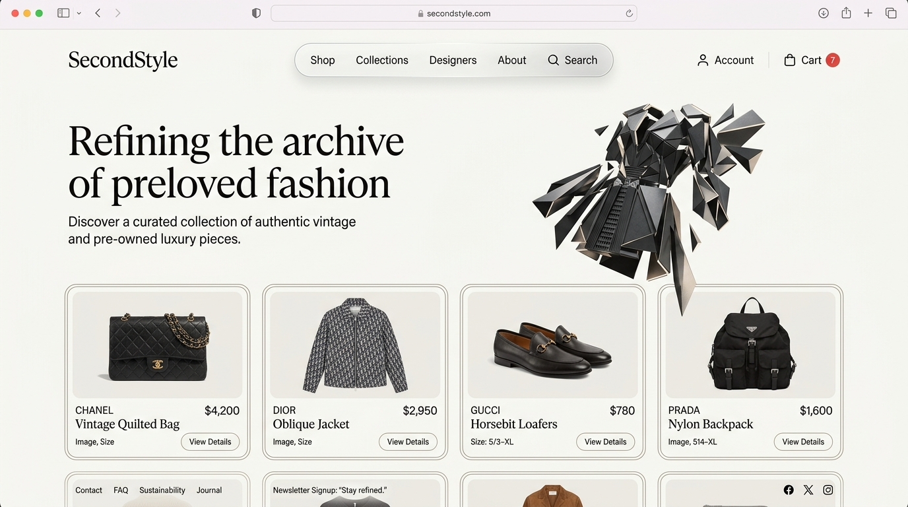

# SecondStyle : Editorial Preloved Luxury Archive

[](#)
[](#)
[](#)



---

## 📖 Cerita di Balik Project Ini (Story of This Project)

> **Catatan Pembuat (Personal Note):**  
> *"Project ini adalah jejak awal perjalanan saya saat pertama kali belajar ngoding dan mengenal dasar-dasar web development (HTML & CSS murni) di bangku **Kelas 10 SMK/SMA**. Awalnya dibuat sebagai latihan tugas sekolah untuk memahami struktur website e-commerce.*  
>  
> *Sekarang, repositori ini telah di-**redesign total** menjadi sebuah platform digital fashion preloved modern berstandar agensi profesional internasional (Awwwards-tier) — membuktikan evolusi dari sebuah kode dasar kelas 10 menjadi pengalaman digital yang matang, interaktif, elegan, dan fungsional penuh."*

---

## ✨ Fitur & Keunggulan Utama (Key Features)

### 1. 🎨 Desain Anti-Slop & Tipografi Editorial Mewah
- **Tipografi Non-Bold yang Elegan:** Menggunakan kurasi font Google **`Plus Jakarta Sans`**, **`Syne`**, dan **`Cinzel`** dengan bobot ringan (*font-weight: 300 & 400*) dan tracking luas. Tidak ada judul tebal kasar atau template monoton.
- **Arsitektur Doppelrand (Double-Bezel):** Setiap kartu produk dan panel menggunakan bingkai bertingkat (*nested concentric radius* 24px outer / 18px inner) dengan pantulan bayangan ambient haptic.
- **Palet Warna Kurasi:** *Warm Alabaster* (`#fbfbf9`), *Luxury Obsidian* (`#0c0e12`), *Muted Pearl* (`#eae8e1`), serta aksen *Champagne Gold* (`#bfa175`) dan *Forest Emerald* (`#2d6a4f`).

### 2. 🪐 Animasi 3D Interaktif & Media Lookbook
- **Interactive Three.js 3D Hero Canvas:** Visualizer 3D kain/hoodie geometris prosedural di halaman utama (`index.html`) yang berputar dengan inersia halus (*smooth damping*) dan merespons orbit kursor mouse serta sentuhan layar.
- **3D 360° Product Inspector:** Di halaman `detailproduk.html`, pengguna dapat beralih antara foto galeri resolusi tinggi dan model 3D interaktif yang dapat diputar 360 derajat.
- **Kartu Tilt Perspektif 3D:** Kartu drop produk memiliki efek miring perspektif 3D interaktif saat kursor diarahkan (*hover*).
- **Kinetic Infinite Marquee:** Banner berjalan dinamis yang mengumumkan promo diskon dan sertifikasi kurasi preloved.
- **Modal Video Campaign:** Teaser video editorial dokumenter fesyen Tokyo & Paris di halaman `aboutus.html`.

### 3. 🛍️ Sistem E-Commerce Lengkap & Fungsional (11 Halaman)
- **`index.html`:** Landing page editorial dengan 3D hero canvas, banner lookbook, kartu produk drop pilihan, dan nilai kurasi.
- **`homepage.html`:** Katalog lengkap dengan fitur **Live Search** seketika, filter pill kategori (*Hoodies*, *Outerwear*, *Vintage Tees*, *Bottoms*), sortir harga, dan **Quick View Modal**.
- **`detailproduk.html`:** Detail pakaian, selector ukuran (S, M, L, XL), stepper kuantitas, tombol *Add to Bag*, alur *Buy It Now* instan, serta accordion tabel ukuran dan grading kondisi (Grade A+).
- **`cart.html`:** Keranjang belanja interaktif dengan **Free Shipping Progress Meter** (threshold Rp 500.000) dan **Promo Voucher Engine** (masukkan kode `SECOND9` untuk diskon 25%).
- **`checkout.html`:** Alur pembayaran terenkripsi 2 kolom dengan auto-fill alamat dan **Visual Payment Selector** (*QRIS / E-Wallet*, *Virtual Account Bank*, *Credit Card*).
- **`thankyou.html`:** Konfirmasi sukses pesanan dengan generator ID unik (misal: `SEC-2026-8924`), rincian struk, tombol cetak invoice (*Print Receipt*), dan tautan ke dashboard.
- **`aboutus.html`:** Kisah brand bergaya majalah editorial, metrik keberlanjutan (1.420+ kg tekstil diselamatkan), timeline interaktif 2023–2026, dan modal video.
- **`profile.html`:** Dashboard pelanggan yang menampilkan **Order History riil** dari pesanan yang dibuat saat checkout, manajemen alamat pengiriman, dan preferensi akun.
- **`login.html`, `create_account.html`, `forgot_password.html`:** Alur autentikasi mewah dengan toggle intip password dan validasi data.

---

## 🛠️ Arsitektur Teknologi (Tech Stack)

```
c:/e-commerce-basic/
├── css/
│   └── style.css            # Central Modern CSS Design System & Utility Tokens
├── js/
│   ├── store.js             # Reactive State Engine (Cart, Promo, Orders, User, Toasts)
│   └── 3d-scene.js          # Three.js WebGL Interactive 3D Canvas Visualizer
├── img/
│   ├── preview.jpg          # Website Preview Screenshot Mockup
│   └── ...                  # Curated Garment Photography Assets
├── tests/
│   └── verify-all.js        # Automated End-to-End Node.js Test Suite (62/62 Passed)
├── index.html               # Luxury Landing Page
├── homepage.html            # Shop Catalog & Dual Data Source
├── detailproduk.html        # Product Detail & 3D Toggle
├── cart.html                # Interactive Shopping Cart
├── checkout.html            # Checkout & Visual Payment Gateways
├── thankyou.html            # Order Confirmation & Receipt Invoice
├── aboutus.html             # Brand Manifesto & Timeline
├── profile.html             # Customer Profile & Dynamic Order History
├── login.html               # Sign In
├── create_account.html      # Create Account
└── forgot_password.html     # Password Reset
```

---

## 🚀 Cara Menjalankan Website (Quick Start)

Website ini dibangun menggunakan teknologi web standar tanpa memerlukan build tools yang rumit:

1. **Clone repositori:**
   ```bash
   git clone https://github.com/BintangPPLG/e-commerce-basic.git
   cd e-commerce-basic
   ```

2. **Jalankan local server (pilih salah satu):**
   - Menggunakan Python:
     ```bash
     python -m http.server 8080
     ```
   - Menggunakan Node.js (`npx serve`):
     ```bash
     npx serve -l 8080
     ```
   - Atau cukup klik dua kali pada file `index.html` untuk membuka langsung di browser.

3. **Buka di peramban (browser):**
   ```
   http://localhost:8080/index.html
   ```

---

## 🧪 Pengujian Otomatis (Automated Testing)

Jalankan suite verifikasi otomatis untuk memastikan seluruh endpoint dan fungsionalitas bekerja sempurna:
```bash
node tests/verify-all.js
```
```
====================================================
SecondStyle Comprehensive Verification Suite
Results: 62 PASSED, 0 FAILED
====================================================
```

---

## 📜 Lisensi & Kredit

- **Author:** Narendra Bintang Ramadan ([@BintangPPLG](https://github.com/BintangPPLG))
- **Original Creation:** Tugas Awal Kelas 10 (HTML & CSS Dasar)
- **Redesign & Engineering:** 2026 Full Professional Overhaul (Editorial Luxury Fashion & Interactive 3D Web)
